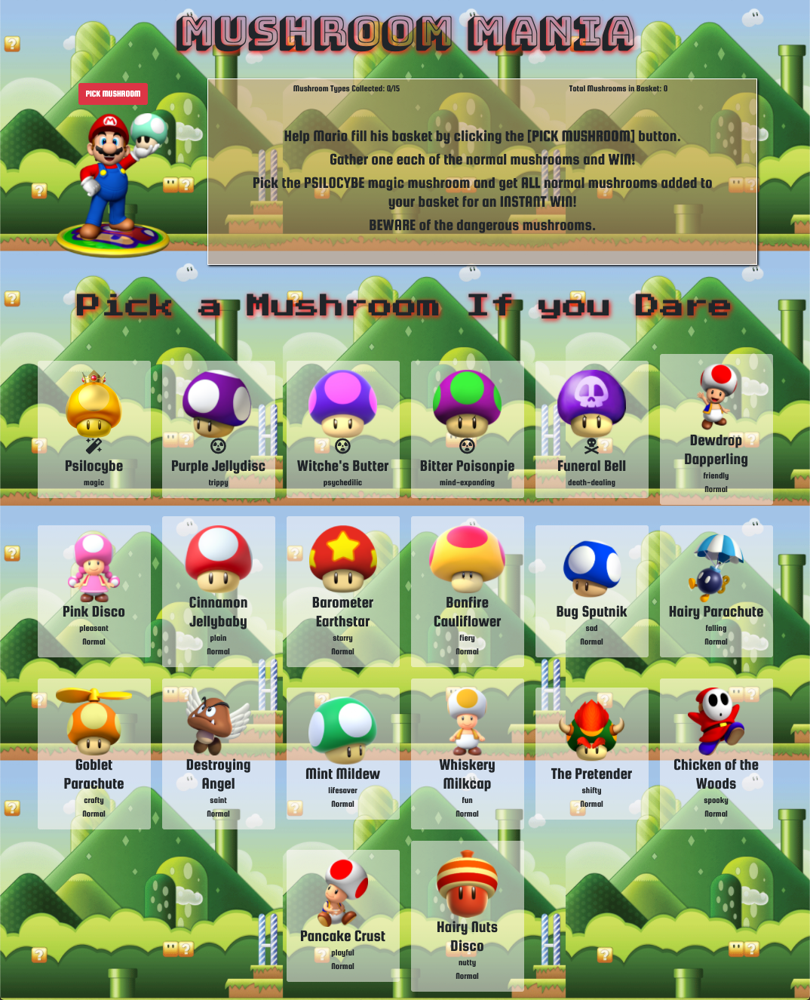
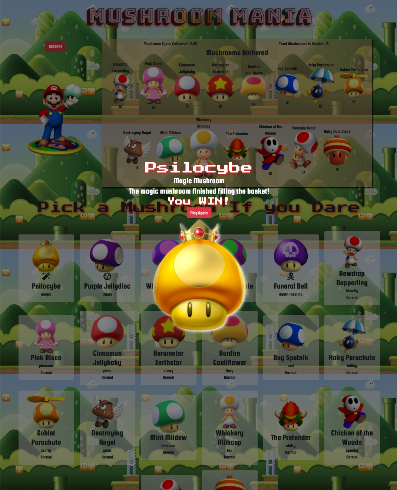
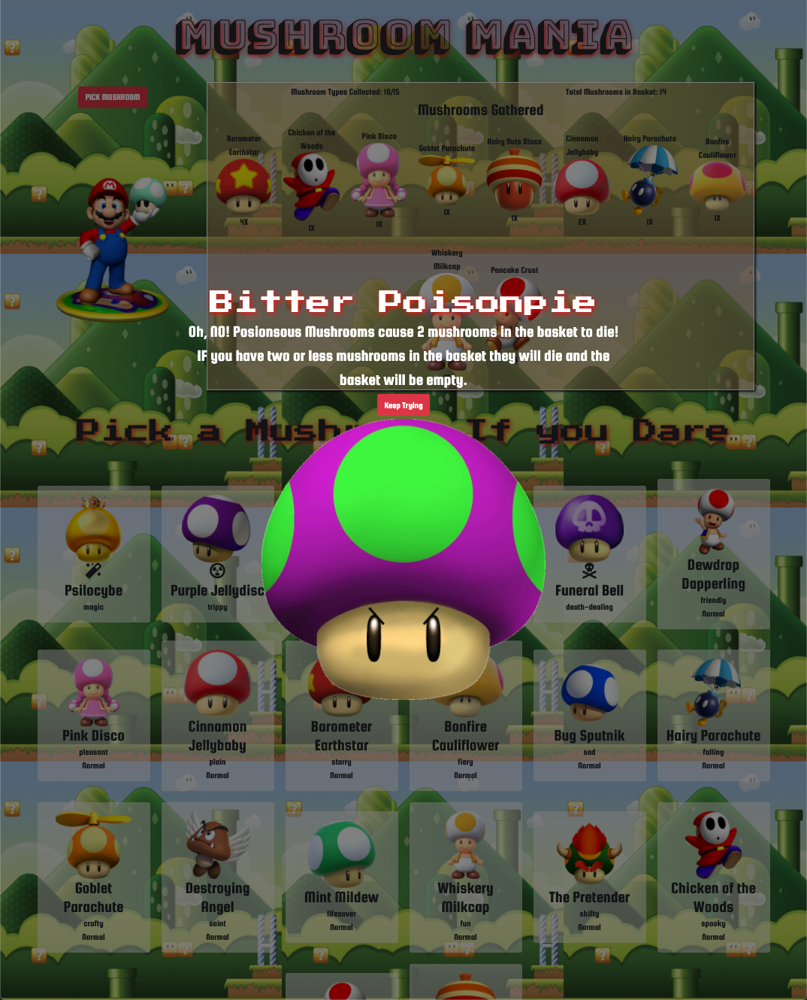
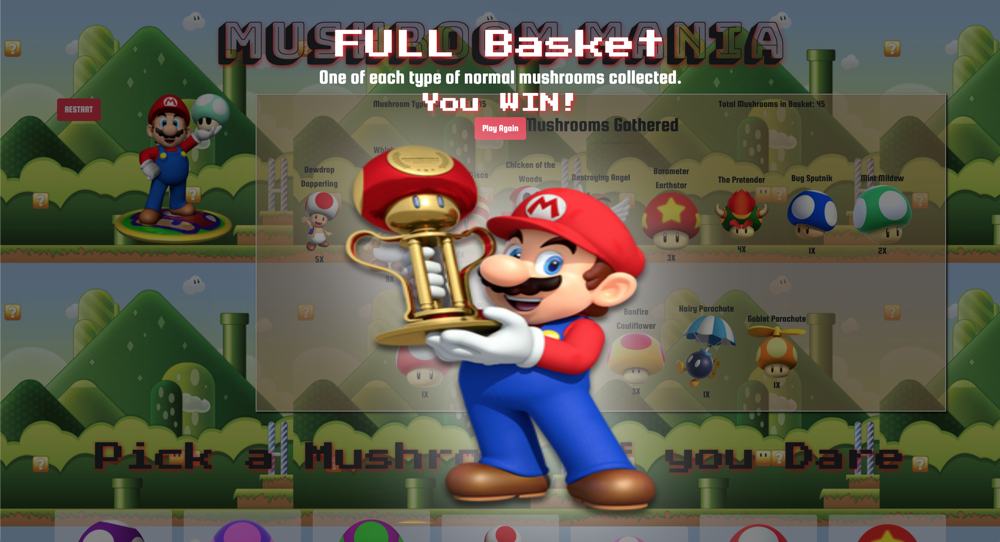
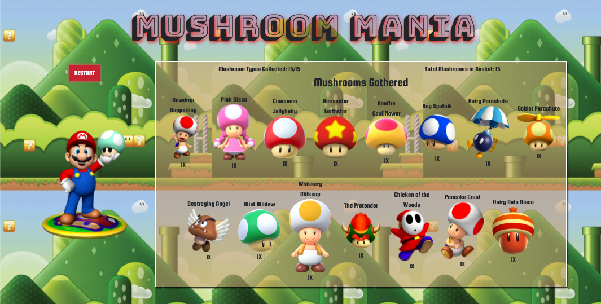

# Mushroom Mania

## Description

Time to help Mario collect one of each mushroom in the forest. Using React under the hood to make the magic happen. This project was an introductory project to React. Focusing on data and components for a better understanding of how data is manipulated, communicated and displayed using React.

<strong> Project specifications found [here. </strong>](https://github.com/nss-nightclass-projects/exercise-vault/blob/master/REACT_mushroom_picker.md)

## Technologies & Tools

- React, Reactstrap, Bootstrap, CSS, ES6, HTML, JavaScript (vanilla), Webpack

## Screenshots

**Start Screen**

View deployed site: https://mushroom-mania-sh.web.app/

Or Run locally:

1. Install npm http-server [Click here for instructions](https://www.npmjs.com/package/http-server)

2. [Clone project](https://help.github.com/en/github/creating-cloning-and-archiving-repositories/cloning-a-repository)

3. Open file

4. Run command: `npm install`

5. Run command: `hs -p 8080`
